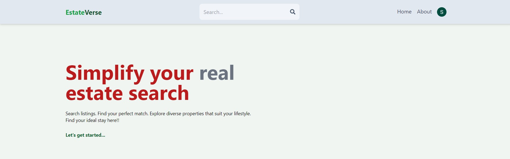
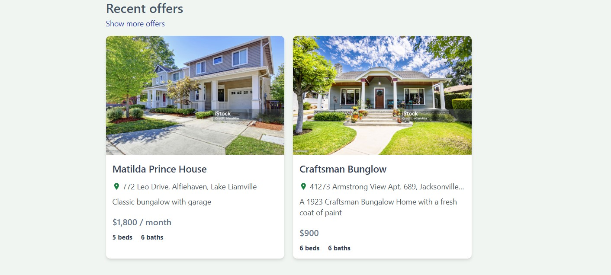
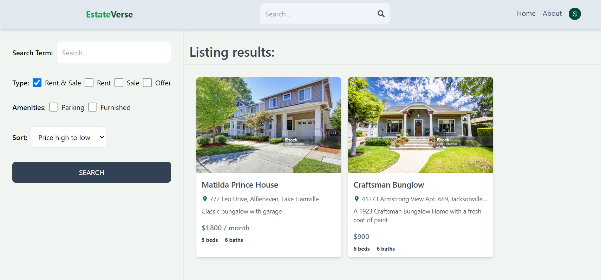

# EstateVerse

## Our Top Contributors 

  
  
  

## Project Snippets 

## Project Overview

EstateVerse is a web application that helps users manage and explore real estate listings. It provides features like:
User authentication and profile management
Listing creation and editing 
Search and filter functionalities

## Tech Stack
Frontend: React, Vite
Backend: Node.js, Express.js
Database: MongoDB
Authentication & Storage: Firebase

## Getting Started

### Prerequisites

Node.js and npm (or yarn) installed on your system.
A Firebase project with configured authentication and storage.
### Forking and Cloning the Repository

Fork this repository on GitHub.
Clone your forked repository to your local machine using Git.

### Installing Dependencies

#### Backend (api)

Navigate to the api directory:
Bash
`cd api`

Install dependencies:
`npm install`

#### Frontend (client)

Navigate to the client directory:
`cd client`

Install dependencies:
`npm install`

### Running the Application

#### Backend (api)
Set up your MongoDB connection string in the .env file.
Start the backend server:
`npm start`

#### Frontend (client)
Set up your Firebase configuration in the .env file (client-side).
Start the development server:
`npm run dev`

## Setting Up Database and Authentication

### MongoDB Atlas Setup

Create a free MongoDB Atlas account.
Create a new cluster and database.
Secure your cluster by enabling authentication and creating a user.
Obtain the connection string for your MongoDB database.
Add the connection string to your backend project's .env file (api).
### Firebase Authentication and Storage

Create a Firebase project in the Firebase console.
Enable authentication and storage services for your project.
Download the Firebase configuration file (google-services.json or equivalent).
Place the configuration file in the root of your frontend project (client).
Follow Firebase documentation to set up authentication and storage functionalities in your frontend code.

## How did we divde our work:

<a href="https://github.com/Ayu1C">Ayushi</a> handeled the Frontend and laid out the User Interface maintaining the responsiveness of the interface.
<a href="https://github.com/ayushharode">Ayush</a> took over the component integration and implemented the overall logic and dataflow within the project.
<a href="https://github.com/Sujal-2820">Sujal</a> handeled the Backend and integrated Firebase for Image Processing and Authentication

## Contributing
We welcome contributions to this project! Please refer to the **<code><a href="https://github.com/Sujal-2820/Real-Estate-Web-Application/blob/main/CONTRIBUTING.md">CONTRIBUTING.md</a></code>** file for guidelines on how to contribute.
